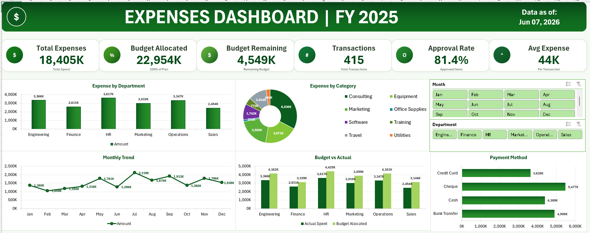

# Automated-Excel-Expense-Dashboard
Overview
This repository contains a fully automated, professional Expenses Dashboard built entirely in Excel using a single, self-contained VBA module. The tool takes raw expense data and dynamically generates a beautifully formatted, interactive dashboard complete with KPI cards, charts, and slicers—all within seconds.

Key Features
•	One-Click Automation: A single public entry point (BuildExpensesDashboard) orchestrates the entire build process, from formatting the raw data to drawing the final shapes.
•	Live Progress Tracking: Features a dynamic UI with step-by-step progress messages in the Excel status bar, utilizing DoEvents to keep animations visible and the screen responsive without freezing.
•	Dynamic KPI Cards: Automatically builds 6 visual KPI cards with custom icons, gradient fills, and shadow effects for: 
o	Total Expenses
o	Budget Allocated
o	Budget Remaining
o	Transactions
o	Approval Rate
o	Avg Expense
•	Automated Charting: Dynamically generates and formats 5 distinct charts: 
1.	Expense by Department (Clustered Column)
2.	Expense by Category (Doughnut Chart)
3.	Monthly Trend (Line Chart with Markers)
4.	Budget vs Actual (Clustered Column)
5.	Payment Method (Clustered Bar Chart)
•	Interactive Slicers: Includes highly customized "Month" (4 columns) and "Department" (6 columns) slicers connected to 7 underlying PivotTables for seamless data filtering.
•	Smart Data Handling: Automatically detects if a "Month" column is missing from the raw data and inserts one, populating it with a formula based on the "Date" column.
•	Polished UI/UX: Applies a unified design system using the "Aptos" font, custom RGB color schemes, hidden gridlines, zoomed views (70%), and tailored number formatting (e.g., values rounded to thousands with a "K" suffix).
Prerequisites
•	Microsoft Excel for Windows (Office 2016 or later).
•	A worksheet named exactly Data containing your raw data.
•	The Data sheet must include the following headers in Row 1 (order does not matter): 
o	Expense ID
o	Date
o	Department
o	Category
o	Amount (INR)
o	Payment Method
o	Approved
o	Budget Allocated
o	Budget Remaining
How to Use
1.	Open the provided Excel workbook and ensure your data is pasted into the Data sheet with the required headers.
2.	Press Alt + F11 to open the VBA Editor.
3.	Insert a new standard module (Insert > Module) and paste the entire VBA script.
4.	Close the VBA editor.
5.	Press Alt + F8, select BuildExpensesDashboard, and click Run.
6.	Watch the status bar for live progress updates as the tool cleans the data, builds PivotTables, and draws the dashboard. A success message will confirm when it is complete.
Technical Architecture & Skills Showcased
This project demonstrates advanced proficiency in Excel VBA and dashboard architecture:
•	VBA Object Model Mastery: Programmatic creation of PivotCaches, PivotTables, ListObjects (Excel Tables), SlicerCaches, and ChartObjects.
•	Shape & Canvas Manipulation: Precise, dynamic calculation of layout positions using Double variables to place text boxes, icons, and gradient banners seamlessly without relying on hardcoded static cell references.
•	Performance Optimization: Strategic toggling of Application.DisplayAlerts and Application.EnableEvents alongside controlled Application.ScreenUpdating = True to balance macro speed with user experience.
•	Robust Error Handling: Implements comprehensive On Error GoTo CleanFail routines to ensure the application environment (like the status bar and calculations) resets gracefully if an error occurs during the build steps.
